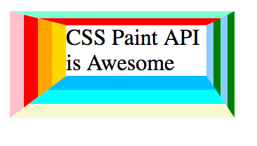

`border-color` is a polyfill for the new CSS feature of having multicolored borders. This is a great show-case of how Houdini APIs can polyfill future web platform features efficiently without having to wait for browser vendors.

